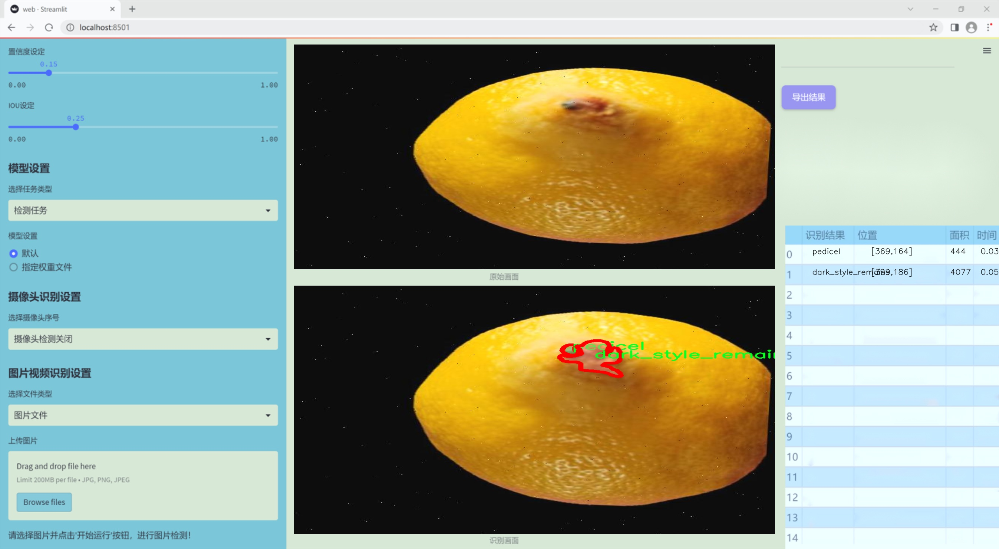
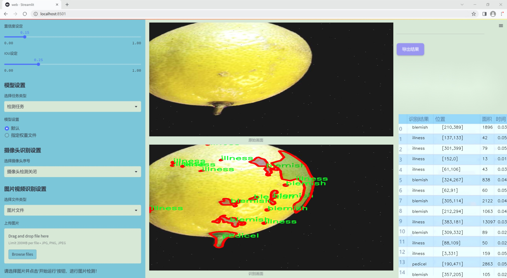
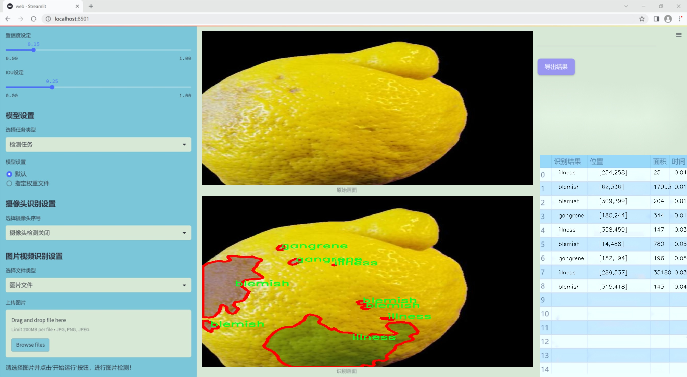
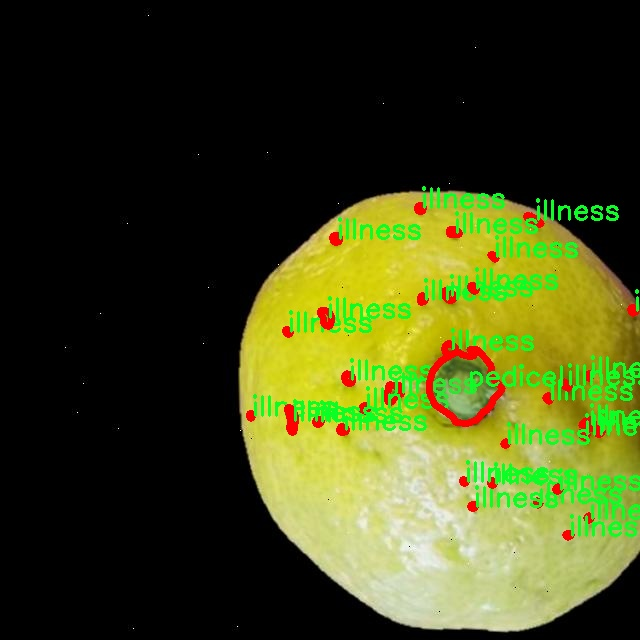
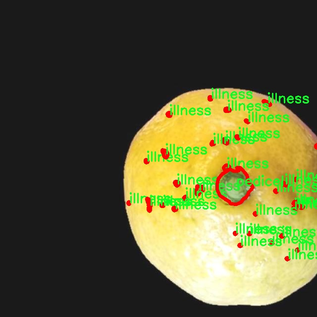
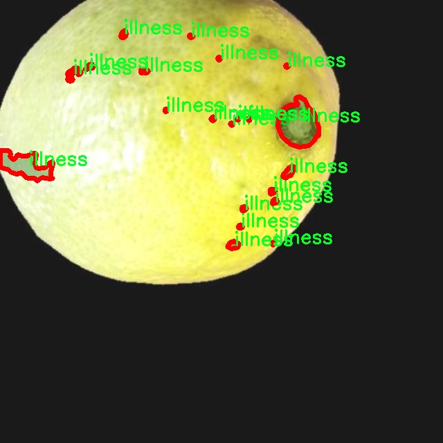
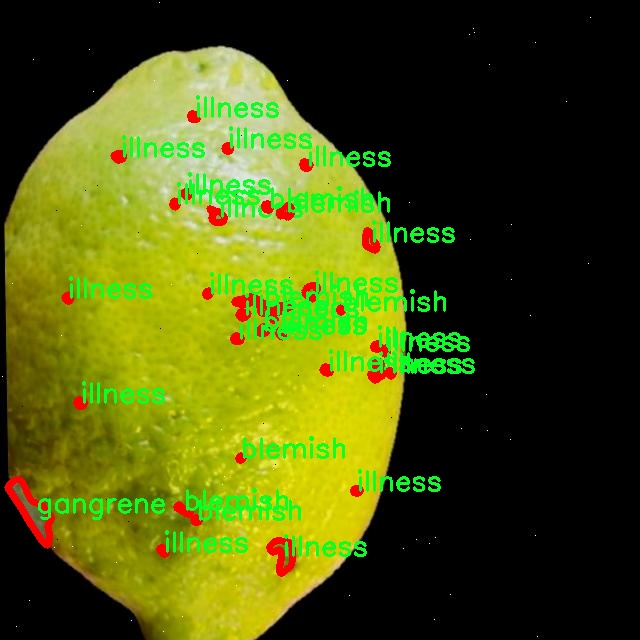
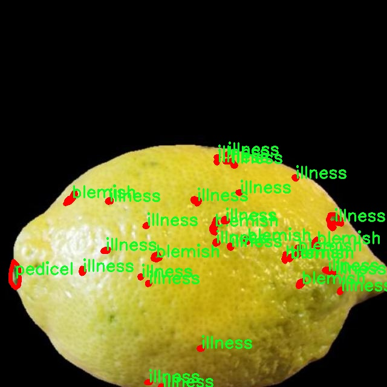

### 1.背景意义

研究背景与意义

随着全球农业科技的迅速发展，水果质量与缺陷检测已成为提高农业生产效率和产品质量的重要研究领域。柠檬作为一种广泛种植和消费的水果，其质量直接影响到市场销售和消费者满意度。然而，传统的人工检测方法不仅耗时耗力，而且容易受到主观因素的影响，导致检测结果的不一致性。因此，开发一种高效、准确的自动化检测系统显得尤为重要。

基于改进YOLOv11的柠檬水果质量与缺陷检测系统，旨在利用深度学习技术，结合先进的计算机视觉算法，实现对柠檬水果的快速检测与分类。该系统将应用于对柠檬的多种缺陷进行识别，包括瑕疵、病害、霉变等，确保在采摘和运输过程中及时发现问题，降低损失。此外，通过对柠檬质量的实时监测，能够为果农提供科学的管理依据，提升果品的市场竞争力。

本研究所使用的数据集包含2700张标注图像，涵盖了8种不同的缺陷类别，如“artifact”、“blemish”、“gangrene”等。这些数据的多样性和丰富性为模型的训练提供了坚实的基础。通过对数据集的深入分析与处理，采用实例分割的方式，可以更精确地识别和定位柠檬上的缺陷，从而提高检测的准确性和可靠性。

综上所述，基于改进YOLOv11的柠檬水果质量与缺陷检测系统，不仅具有重要的理论研究价值，还有助于推动农业智能化的发展，提升水果产业的整体水平。这一研究将为实现农业生产的数字化、智能化提供新的思路和方法，为可持续农业发展贡献力量。

### 2.视频效果

[2.1 视频效果](https://www.bilibili.com/video/BV1wrBMYaEae/)

### 3.图片效果







##### [项目涉及的源码数据来源链接](https://kdocs.cn/l/cszuIiCKVNis)**

注意：本项目提供训练的数据集和训练教程,由于版本持续更新,暂不提供权重文件（best.pt）,请按照6.训练教程进行训练后实现上图演示的效果。

### 4.数据集信息

##### 4.1 本项目数据集类别数＆类别名

nc: 8
names: ['artifact', 'blemish', 'dark_style_remains', 'gangrene', 'illness', 'image_quality', 'mould', 'pedicel']


该项目为【图像分割】数据集，请在【训练教程和Web端加载模型教程（第三步）】这一步的时候按照【图像分割】部分的教程来训练

##### 4.2 本项目数据集信息介绍

本项目数据集信息介绍

本项目旨在开发一个改进的YOLOv11模型，以实现柠檬水果的质量与缺陷检测。为此，我们构建了一个专门的数据集，主题为“FRUIT QUALITY AND DEFECT CL”，该数据集包含了多种与柠檬水果质量相关的缺陷类型。数据集中共涵盖8个类别，具体包括：artifact（伪影）、blemish（瑕疵）、dark_style_remains（暗色风格残留）、gangrene（坏疽）、illness（疾病）、image_quality（图像质量）、mould（霉变）以及pedicel（果梗）。这些类别不仅反映了柠檬在生长和存储过程中可能遭遇的各种质量问题，还为模型的训练提供了丰富的样本和多样化的特征。

在数据集的构建过程中，我们注重数据的多样性和代表性，确保每个类别都包含足够的样本，以便模型能够学习到不同缺陷的特征。例如，瑕疵和霉变可能在视觉上有明显的差异，而坏疽和疾病则可能需要更细致的特征提取。通过精心挑选和标注样本，我们希望模型能够在实际应用中准确识别出柠檬的质量问题，从而为农产品的质量控制提供有效的技术支持。

此外，为了提升模型的鲁棒性，我们还对数据集进行了多种数据增强处理，包括旋转、缩放、翻转等操作。这些增强措施旨在模拟不同的拍摄条件和环境变化，使得训练后的模型能够在多种实际场景中保持良好的性能。通过这一系列的努力，我们期望构建一个高效、准确的柠檬水果质量与缺陷检测系统，为农业生产和食品安全提供重要的技术保障。











### 5.全套项目环境部署视频教程（零基础手把手教学）

[5.1 所需软件PyCharm和Anaconda安装教程（第一步）](https://www.bilibili.com/video/BV1BoC1YCEKi/?spm_id_from=333.999.0.0&vd_source=bc9aec86d164b67a7004b996143742dc)


[5.2 安装Python虚拟环境创建和依赖库安装视频教程（第二步）](https://www.bilibili.com/video/BV1ZoC1YCEBw?spm_id_from=333.788.videopod.sections&vd_source=bc9aec86d164b67a7004b996143742dc)

### 6.改进YOLOv11训练教程和Web_UI前端加载模型教程（零基础手把手教学）

[6.1 改进YOLOv11训练教程和Web_UI前端加载模型教程（第三步）](https://www.bilibili.com/video/BV1BoC1YCEhR?spm_id_from=333.788.videopod.sections&vd_source=bc9aec86d164b67a7004b996143742dc)


按照上面的训练视频教程链接加载项目提供的数据集，运行train.py即可开始训练



     Epoch   gpu_mem       box       obj       cls    labels  img_size
     1/200     20.8G   0.01576   0.01955  0.007536        22      1280: 100%|██████████| 849/849 [14:42<00:00,  1.04s/it]
               Class     Images     Labels          P          R     mAP@.5 mAP@.5:.95: 100%|██████████| 213/213 [01:14<00:00,  2.87it/s]
                 all       3395      17314      0.994      0.957      0.0957      0.0843

     Epoch   gpu_mem       box       obj       cls    labels  img_size
     2/200     20.8G   0.01578   0.01923  0.007006        22      1280: 100%|██████████| 849/849 [14:44<00:00,  1.04s/it]
               Class     Images     Labels          P          R     mAP@.5 mAP@.5:.95: 100%|██████████| 213/213 [01:12<00:00,  2.95it/s]
                 all       3395      17314      0.996      0.956      0.0957      0.0845

     Epoch   gpu_mem       box       obj       cls    labels  img_size
     3/200     20.8G   0.01561    0.0191  0.006895        27      1280: 100%|██████████| 849/849 [10:56<00:00,  1.29it/s]
               Class     Images     Labels          P          R     mAP@.5 mAP@.5:.95: 100%|███████   | 187/213 [00:52<00:00,  4.04it/s]
                 all       3395      17314      0.996      0.957      0.0957      0.0845


###### [项目数据集下载链接](https://kdocs.cn/l/cszuIiCKVNis)

### 7.原始YOLOv11算法讲解


YOLO11 是 Ultralytics YOLO 系列的最新版本，结合了尖端的准确性、速度和效率，用于目标检测、分割、分类、定向边界框和姿态估计。与
YOLOv8 相比，它具有更少的参数和更好的结果，不难预见，YOLO11 在边缘设备上更高效、更快，将频繁出现在计算机视觉领域的最先进技术（SOTA）中。


**主要特点**

  * **增强的特征提取：**YOLO11 使用改进的主干和颈部架构来增强特征提取，以实现更精确的目标检测和复杂任务的性能。

  * **针对效率和速度优化：**精细的架构设计和优化的训练流程在保持准确性和性能之间最佳平衡的同时，提供更快的处理速度。

  * **更少的参数，更高的准确度：**YOLO11m 在 COCO 数据集上实现了比 YOLOv8m 更高的 mAP，参数减少了 22%，提高了计算效率，同时不牺牲准确度。

  * **跨环境的适应性：**YOLO11 可以无缝部署在边缘设备、云平台和配备 NVIDIA GPU 的系统上，确保最大的灵活性。

  * **支持广泛的任务范围：**YOLO11 支持各种计算机视觉任务，如目标检测、实例分割、图像分类、姿态估计和定向目标检测（OBB）。


### 8.200+种全套改进YOLOV11创新点原理讲解

#### 8.1 200+种全套改进YOLOV11创新点原理讲解大全

由于篇幅限制，每个创新点的具体原理讲解就不全部展开，具体见下列网址中的改进模块对应项目的技术原理博客网址【Blog】（创新点均为模块化搭建，原理适配YOLOv5~YOLOv11等各种版本）

[改进模块技术原理博客【Blog】网址链接](https://gitee.com/qunmasj/good)


#### 8.2 精选部分改进YOLOV11创新点原理讲解

###### 这里节选部分改进创新点展开原理讲解(完整的改进原理见上图和[改进模块技术原理博客链接](https://gitee.com/qunmasj/good)【如果此小节的图加载失败可以通过CSDN或者Github搜索该博客的标题访问原始博客，原始博客图片显示正常】


### D-LKA Attention简介
自2010年代中期以来，卷积神经网络（CNNs）已成为许多计算机视觉应用的首选技术。它们能够从原始数据中自动提取复杂的特征表示，无需手动进行特征工程，这引起了医学图像分析社区的极大兴趣。许多成功的CNN架构，如U-Net、全卷积网络、DeepLab或SegCaps（分割胶囊），已经被开发出来。这些架构在语义分割任务中取得了巨大成功，先前的最新方法已经被超越。

在计算机视觉研究中，不同尺度下的目标识别是一个关键问题。在CNN中，可检测目标的大小与相应网络层的感受野尺寸密切相关。如果一个目标扩展到超出这个感受野的边界，这可能会导致欠分割结果。相反，与目标实际大小相比使用过大的感受野可能会限制识别，因为背景信息可能会对预测产生不必要的影响。

解决这个问题的一个有希望的方法涉及在并行使用具有不同尺寸的多个Kernel，类似于Inception块的机制。然而，由于参数和计算要求的指数增长，将Kernel大小增加以容纳更大的目标在实践中受到限制。因此，出现了各种策略，包括金字塔池化技术和不同尺度的扩张卷积，以捕获多尺度的上下文信息。

另一个直观的概念涉及将多尺度图像金字塔或它们的相关特征表示直接纳入网络架构。然而，这种方法存在挑战，特别是在管理训练和推理时间方面的可行性方面存在挑战。在这个背景下，使用编码器-解码器网络，如U-Net，已被证明是有利的。这样的网络在较浅的层中编码外观和位置，而在更深的层中，通过神经元的更广泛的感受野捕获更高的语义信息和上下文信息。

一些方法将来自不同层的特征组合在一起，或者预测来自不同尺寸的层的特征以使用多尺度的信息。此外，出现了从不同尺度的层中预测特征的方法，有效地实现了跨多个尺度的见解整合。然而，大多数编码器-解码器结构面临一个挑战：它们经常无法在不同尺度之间保持一致的特征，并主要使用最后一个解码器层生成分割结果。

语义分割是一项任务，涉及根据预定义的标签集为图像中的每个像素预测语义类别。这项任务要求提取高级特征同时保留初始的空间分辨率。CNNs非常适合捕获局部细节和低级信息，尽管以忽略全局上下文为代价。视觉Transformer（ViT）架构已经成为解决处理全局信息的视觉任务的关键，包括语义分割，取得了显著的成功。

ViT的基础是注意力机制，它有助于在整个输入序列上聚合信息。这种能力使网络能够合并远程的上下文提示，超越了CNN的有限感受野尺寸。然而，这种策略通常会限制ViT有效建模局部信息的能力。这种局限可能会妨碍它们检测局部纹理的能力，这对于各种诊断和预测任务至关重要。这种缺乏局部表示可以归因于ViT模型处理图像的特定方式。

ViT模型将图像分成一系列Patch，并使用自注意力机制来模拟它们之间的依赖关系。这种方法可能不如CNN模型中的卷积操作对感受野内提取局部特征有效。ViT和CNN模型之间的这种图像处理方法的差异可能解释了CNN模型在局部特征提取方面表现出色的原因。

近年来，已经开发出创新性方法来解决Transformer模型内部局部纹理不足的问题。其中一种方法是通过互补方法将CNN和ViT特征结合起来，以结合它们的优势并减轻局部表示的不足。TransUNet是这种方法的早期示例，它在CNN的瓶颈中集成了Transformer层，以模拟局部和全局依赖关系。HiFormer提出了一种解决方案，将Swin Transformer模块和基于CNN的编码器结合起来，生成两个多尺度特征表示，通过Double-Level Fusion模块集成。UNETR使用基于Transformer的编码器和CNN解码器进行3D医学图像分割。CoTr和TransBTS通过Transformer在低分辨率阶段增强分割性能，将CNN编码器和解码器连接在一起。

增强局部特征表示的另一种策略是重新设计纯Transformer模型内部的自注意力机制。在这方面，Swin-Unet在U形结构中集成了一个具有线性计算复杂性的Swin Transformer块作为多尺度 Backbone 。MISSFormer采用高效Transformer来解决视觉Transformer中的参数问题，通过在输入块上进行不可逆的降采样操作。D-Former引入了一个纯Transformer的管道，具有双重注意模块，以分段的方式捕获细粒度的局部注意和与多元单元的交互。然而，仍然存在一些特定的限制，包括计算效率低下，如TransUNet模型所示，对CNN Backbone 的严重依赖，如HiFormer所观察到的，以及对多尺度信息的忽略。

此外，目前的分割架构通常采用逐层处理3D输入 volumetric 的方法，无意中忽视了相邻切片之间的潜在相关性。这一疏忽限制了对 volumetric 信息的全面利用，因此损害了定位精度和上下文集成。此外，必须认识到，医学领域的病变通常在形状上发生变形。因此，用于医学图像分析的任何学习算法都必须具备捕捉和理解这些变形的能力。与此同时，该算法应保持计算效率，以便处理3D volumetric数据。

为了解决上述提到的挑战，作者提出了一个解决方案，即可变形大卷积核注意力模块（Deformable LKA module），它是作者网络设计的基本构建模块。这个模块明确设计成在有效处理上下文信息的同时保留局部描述符。作者的架构在这两个方面的平衡增强了实现精确语义分割的能力。

值得注意的是，参考该博客引入了一种基于数据的感受野的动态适应，不同于传统卷积操作中的固定滤波器Mask。这种自适应方法使作者能够克服与静态方法相关的固有限制。这种创新方法还扩展到了D-LKA Net架构的2D和3D版本的开发。

在3D模型的情况下，D-LKA机制被量身定制以适应3D环境，从而实现在不同 volumetric 切片之间无缝信息交互。最后，作者的贡献通过其计算效率得到进一步强调。作者通过仅依靠D-LKA概念的设计来实现这一点，在各种分割基准上取得了显著的性能，确立了作者的方法作为一种新的SOTA方法。

在本节中，作者首先概述方法论。首先，作者回顾了由Guo等人引入的大卷积核注意力（Large Kernel Attention，LKA）的概念。然后，作者介绍了作者对可变形LKA模块的创新探索。在此基础上，作者介绍了用于分割任务的2D和3D网络架构。

大卷积核提供了与自注意力机制类似的感受野。可以通过使用深度卷积、深度可扩展卷积和卷积来构建大卷积核，从而减少了参数和计算量。构建输入维度为和通道数的卷积核的深度卷积和深度可扩展卷积的卷积核大小的方程如下：


具有卷积核大小和膨胀率。参数数量和浮点运算（FLOPs）的计算如下：


FLOPs的数量与输入图像的大小成线性增长。参数的数量随通道数和卷积核大小的增加而呈二次增长。然而，由于它们通常都很小，因此它们不是限制因素。

为了最小化对于固定卷积核大小K的参数数量，可以将方程3对于膨胀率的导数设定为零：


例如，当卷积核大小为时，结果是。将这些公式扩展到3D情况是直接的。对于大小为和通道数C的输入，3D情况下参数数量和FLOPs 的方程如下：


具有卷积核大小和膨胀。


利用大卷积核进行医学图像分割的概念通过引入可变形卷积得以扩展。可变形卷积可以通过整数偏移自由调整采样网格以进行自由变形。额外的卷积层从特征图中学习出变形，从而创建一个偏移场。基于特征本身学习变形会导致自适应卷积核。这种灵活的卷积核形状可以提高病变或器官变形的表示，从而增强了目标边界的定义。

负责计算偏移的卷积层遵循其相应卷积层的卷积核大小和膨胀。双线性插值用于计算不在图像网格上的偏移的像素值。如图2所示，D-LKA模块可以表示为：


其中输入特征由表示，。表示为注意力图，其中每个值表示相应特征的相对重要性。运算符  表示逐元素乘法运算。值得注意的是，LKA不同于传统的注意力方法，它不需要额外的规范化函数，如或。这些规范化函数往往忽视高频信息，从而降低了基于自注意力的方法的性能。

在该方法的2D版本中，卷积层被可变形卷积所替代，因为可变形卷积能够改善对具有不规则形状和大小的目标的捕捉能力。这些目标在医学图像数据中常常出现，因此这种增强尤为重要。

然而，将可变形LKA的概念扩展到3D领域会带来一定的挑战。主要的约束来自于需要用于生成偏移的额外卷积层。与2D情况不同，由于输入和输出通道的性质，这一层无法以深度可分的方式执行。在3D环境中，输入通道对应于特征，而输出通道扩展到，其中是卷积核的大小。大卷积核的复杂性导致沿第3D的通道数扩展，导致参数和FLOPs大幅增加。因此，针对3D情况采用了另一种替代方法。在现有的LKA框架中，深度卷积之后引入了一个单独的可变形卷积层。这种战略性的设计调整旨在减轻扩展到3D领域所带来的挑战。


2D网络的架构如图1所示。第一变种使用MaxViT作为编码器组件，用于高效特征提取，而第二变种则结合可变形LKA层进行更精细、卓越的分割。

在更正式的描述中，编码器生成4个分层输出表示。首先，卷积干扰将输入图像的维度减小到。随后，通过4个MaxViT块的4个阶段进行特征提取，每个阶段后跟随降采样层。随着过程进展到解码器，实施了4个阶段的D-LKA层，每个阶段包含2个D-LKA块。然后，应用Patch扩展层以实现分辨率上采样，同时减小通道维度。最后，线性层负责生成最终的输出。

2D D-LKA块的结构包括LayerNorm、可变形LKA和多层感知器（MLP）。积分残差连接确保了有效的特征传播，即使在更深层也是如此。这个安排可以用数学方式表示为：


其中输入特征，层归一化LN，可变形LKA注意力，深度卷积，线性层和GeLU激活函数。

3D网络架构如图1所示，采用编码器-解码器设计进行分层结构化。首先，一个Patch嵌入层将输入图像的维度从（）减小到（）。在编码器中，采用了3个D-LKA阶段的序列，每个阶段包含3个D-LKA块。在每个阶段之后，通过降采样步骤将空间分辨率减半，同时将通道维度加倍。中央瓶颈包括另一组2个D-LKA块。解码器结构与编码器相对称。

为了将特征分辨率加倍，同时减少通道数，使用转置卷积。每个解码器阶段都使用3个D-LKA块来促进远距离特征依赖性。最终的分割输出由一个卷积层产生，后面跟随一个卷积层以匹配特定类别的通道要求。

为了建立输入图像和分割输出之间的直接连接，使用卷积形成了一个跳跃连接。额外的跳跃连接根据简单的加法对来自其他阶段的特征进行融合。最终的分割图是通过和卷积层的组合产生的。

3D D-LKA块包括层归一化，后跟D-LKA注意力，应用了残差连接的部分。随后的部分采用了一个卷积层，后面跟随一个卷积层，两者都伴随着残差连接。这个整个过程可以总结如下：


带有输入特征 、层归一化 、可变形 LKA 、卷积层 和输出特征 的公式。是指一个前馈网络，包括2个卷积层和激活函数。

表7显示了普通卷积和构建卷积的参数数量比较。尽管标准卷积的参数数量在通道数较多时急剧增加，但分解卷积的参数总体较低，并且增长速度不那么快。

与分解卷积相比，可变形分解卷积增加了大量参数，但仍然明显小于标准卷积。可变形卷积的主要参数是由偏移网络创建的。在这里，作者假设可变形深度卷积的Kernel大小为（5,5），可变形深度空洞卷积的Kernel大小为（7,7）。这导致了21×21大小的大Kernel的最佳参数数量。更高效地生成偏移量的方法将大大减少参数数量。


值得注意的是，引入可变形LKA确实会增加模型的参数数量和每秒的浮点运算次数（FLOPS）。然而，重要的是强调，这增加的计算负载不会影响作者模型的整体推理速度。

相反，对于Batch-size > 1，作者甚至观察到推理时间的减少，如图7所示。例如，基于作者的广泛实验，作者观察到对于Batch-size为16，具有可变形卷积和没有可变形卷积的推理时间分别为8.01毫秒和17.38毫秒。作者认为这是由于在2D中对可变形卷积的高效实现所致。为了测量时间，使用了大小为（）的随机输入。在GPU热身周期50次迭代之后，网络被推断了1000次。测量是在NVIDIA RTX 3090 GPU上进行的。


为了充分利用性能与参数之间的权衡关系，作者在图8中可视化了在Synapse 2D数据集上报告的DSC和HD性能以及基于参数数量的内存消耗。D-LKA Net引入了相当多的参数，约为101M。这比性能第二好的方法ScaleFormer使用的111.6M参数要少。

与更轻量级的DAEFormer模型相比，作者实现了更好的性能，这证明了参数增加的合理性。大多数参数来自于MaxViT编码器；因此，将编码器替换为更高效的编码器可以减少模型参数。值得注意的是，在此可视化中，作者最初将HD和内存值都归一化到[0, 100]范围内。随后，作者将它们从100缩小，以增强更高值的表示。


### 9.系统功能展示

图9.1.系统支持检测结果表格显示

  图9.2.系统支持置信度和IOU阈值手动调节

  图9.3.系统支持自定义加载权重文件best.pt(需要你通过步骤5中训练获得)

  图9.4.系统支持摄像头实时识别

  图9.5.系统支持图片识别

  图9.6.系统支持视频识别

  图9.7.系统支持识别结果文件自动保存

  图9.8.系统支持Excel导出检测结果数据


### 10. YOLOv11核心改进源码讲解

#### 10.1 prepbn.py

以下是经过精简和注释的核心代码部分：

```python
import torch
import torch.nn as nn

# 自定义的批归一化类，包含一个可学习的参数 alpha
class RepBN(nn.Module):
    def __init__(self, channels):
        super(RepBN, self).__init__()
        # 初始化可学习参数 alpha，初始值为 1
        self.alpha = nn.Parameter(torch.ones(1))
        # 使用 1D 批归一化
        self.bn = nn.BatchNorm1d(channels)

    def forward(self, x):
        # 将输入张量的维度进行转置，以适应 BatchNorm1d 的输入格式
        x = x.transpose(1, 2)
        # 进行批归一化，并加上 alpha 乘以原始输入
        x = self.bn(x) + self.alpha * x
        # 再次转置回原来的维度
        x = x.transpose(1, 2)
        return x


# 自定义的线性归一化类，包含两个归一化方法
class LinearNorm(nn.Module):
    def __init__(self, dim, norm1, norm2, warm=0, step=300000, r0=1.0):
        super(LinearNorm, self).__init__()
        # 预热阶段的步数
        self.register_buffer('warm', torch.tensor(warm))
        # 当前迭代步数
        self.register_buffer('iter', torch.tensor(step))
        # 总步数
        self.register_buffer('total_step', torch.tensor(step))
        # 初始比例 r0
        self.r0 = r0
        # 第一个归一化方法
        self.norm1 = norm1(dim)
        # 第二个归一化方法
        self.norm2 = norm2(dim)

    def forward(self, x):
        if self.training:  # 如果处于训练模式
            if self.warm > 0:  # 如果还有预热步数
                self.warm.copy_(self.warm - 1)  # 减少预热步数
                x = self.norm1(x)  # 使用第一个归一化方法
            else:
                # 计算当前的 lambda 值，决定两个归一化方法的权重
                lamda = self.r0 * self.iter / self.total_step
                if self.iter > 0:
                    self.iter.copy_(self.iter - 1)  # 减少迭代步数
                # 分别使用两个归一化方法
                x1 = self.norm1(x)
                x2 = self.norm2(x)
                # 根据 lambda 进行加权平均
                x = lamda * x1 + (1 - lamda) * x2
        else:
            # 如果不在训练模式，直接使用第二个归一化方法
            x = self.norm2(x)
        return x
```

### 代码说明：
1. **RepBN 类**：
   - 该类实现了一个自定义的批归一化层，增加了一个可学习的参数 `alpha`，用于调整归一化后的输出与原始输入之间的关系。
   - 在 `forward` 方法中，输入张量的维度被转置，以适应 `BatchNorm1d` 的要求，进行归一化后再加上 `alpha` 乘以原始输入。

2. **LinearNorm 类**：
   - 该类实现了一个线性归一化机制，支持两个不同的归一化方法（`norm1` 和 `norm2`）。
   - 在训练过程中，首先检查是否在预热阶段，如果是，则只使用 `norm1`。当预热结束后，计算一个动态的权重 `lambda`，根据当前的迭代步数来决定使用两个归一化方法的比例。
   - 在非训练模式下，直接使用 `norm2` 进行归一化。

这个文件定义了两个深度学习模型的模块，分别是`RepBN`和`LinearNorm`，它们都是基于PyTorch框架构建的。

首先，`RepBN`类是一个自定义的批量归一化模块。它的构造函数接收一个参数`channels`，表示输入数据的通道数。在构造函数中，定义了一个可学习的参数`alpha`，初始值为1，并创建了一个标准的1维批量归一化层`bn`。在前向传播方法`forward`中，输入数据`x`首先进行维度转置，将通道维移到最后。接着，应用批量归一化层`bn`，并将归一化的结果与`alpha`乘以原始输入`x`相加。最后，再次对结果进行维度转置，以恢复原来的形状并返回。

接下来是`LinearNorm`类，它实现了一种线性归一化机制。构造函数接收多个参数，包括`dim`（输入数据的维度）、`norm1`和`norm2`（分别是两种归一化方法的构造函数）、`warm`（预热步数）、`step`（总步数）和`r0`（初始比例因子）。在构造函数中，使用`register_buffer`方法注册了一些张量，这些张量在模型训练时不会被视为模型参数。`forward`方法中，如果模型处于训练状态，首先检查是否还有预热步数，如果有，则使用`norm1`对输入`x`进行归一化处理。否则，计算一个动态的比例因子`lamda`，并根据当前的迭代次数调整它。接着，分别使用`norm1`和`norm2`对输入`x`进行归一化，最后根据`lamda`的值将两者的结果加权平均。如果模型不在训练状态，则直接使用`norm2`对输入进行归一化处理并返回结果。

总体来说，这两个模块提供了自定义的归一化功能，适用于需要在训练过程中动态调整归一化策略的深度学习模型。`RepBN`通过引入可学习的参数增强了批量归一化的灵活性，而`LinearNorm`则通过线性组合两种归一化方法实现了更复杂的归一化策略。

#### 10.2 test_selective_scan_speed.py

以下是代码中最核心的部分，并附上详细的中文注释：

```python
import torch
import torch.nn.functional as F

def build_selective_scan_fn(selective_scan_cuda: object = None, mode="mamba_ssm", tag=None):
    """
    构建选择性扫描函数的工厂方法。
    
    参数:
    selective_scan_cuda: CUDA实现的选择性扫描函数。
    mode: 选择的模式，决定使用哪种选择性扫描实现。
    tag: 额外的标签信息。
    
    返回:
    selective_scan_fn: 选择性扫描函数。
    """
    
    class SelectiveScanFn(torch.autograd.Function):
        @staticmethod
        def forward(ctx, u, delta, A, B, C, D=None, z=None, delta_bias=None, delta_softplus=False, return_last_state=False, nrows=1, backnrows=-1):
            """
            前向传播方法，计算选择性扫描的输出。
            
            参数:
            ctx: 上下文对象，用于保存信息以便反向传播。
            u: 输入张量。
            delta: 变化率张量。
            A, B, C: 相关参数张量。
            D: 可选的额外参数张量。
            z: 可选的张量。
            delta_bias: 可选的偏置。
            delta_softplus: 是否使用softplus激活。
            return_last_state: 是否返回最后的状态。
            nrows: 行数参数。
            backnrows: 反向传播时的行数参数。
            
            返回:
            out: 输出张量，或包含输出和最后状态的元组。
            """
            # 确保输入张量是连续的
            if u.stride(-1) != 1:
                u = u.contiguous()
            if delta.stride(-1) != 1:
                delta = delta.contiguous()
            if D is not None:
                D = D.contiguous()
            if B.stride(-1) != 1:
                B = B.contiguous()
            if C.stride(-1) != 1:
                C = C.contiguous()
            if z is not None and z.stride(-1) != 1:
                z = z.contiguous()

            # 确保输入张量的维度符合要求
            assert u.shape[1] % (B.shape[1] * nrows) == 0 
            assert nrows in [1, 2, 3, 4]  # 限制行数为1到4

            # 处理反向传播的行数参数
            if backnrows > 0:
                assert u.shape[1] % (B.shape[1] * backnrows) == 0 
                assert backnrows in [1, 2, 3, 4]
            else:
                backnrows = nrows
            ctx.backnrows = backnrows
            
            # 根据模式调用不同的CUDA实现
            if mode == "mamba_ssm":
                out, x, *rest = selective_scan_cuda.fwd(u, delta, A, B, C, D, z, delta_bias, delta_softplus)
            else:
                raise NotImplementedError("未实现的模式")

            ctx.delta_softplus = delta_softplus
            ctx.has_z = z is not None

            last_state = x[:, :, -1, 1::2]  # 获取最后的状态
            ctx.save_for_backward(u, delta, A, B, C, D, delta_bias, x)
            return out if not return_last_state else (out, last_state)

        @staticmethod
        def backward(ctx, dout):
            """
            反向传播方法，计算梯度。
            
            参数:
            ctx: 上下文对象，包含前向传播时保存的信息。
            dout: 输出的梯度。
            
            返回:
            梯度元组，包含各个输入的梯度。
            """
            u, delta, A, B, C, D, delta_bias, x = ctx.saved_tensors
            if dout.stride(-1) != 1:
                dout = dout.contiguous()

            # 调用CUDA实现的反向传播
            du, ddelta, dA, dB, dC, dD, ddelta_bias, *rest = selective_scan_cuda.bwd(
                u, delta, A, B, C, D, delta_bias, dout, x, ctx.delta_softplus, ctx.backnrows
            )

            return (du, ddelta, dA, dB, dC, dD if D is not None else None, ddelta_bias if delta_bias is not None else None)

    def selective_scan_fn(u, delta, A, B, C, D=None, z=None, delta_bias=None, delta_softplus=False, return_last_state=False, nrows=1, backnrows=-1):
        """
        封装选择性扫描函数的调用。
        """
        return SelectiveScanFn.apply(u, delta, A, B, C, D, z, delta_bias, delta_softplus, return_last_state, nrows, backnrows)

    return selective_scan_fn
```

### 代码核心部分说明：
1. **构建选择性扫描函数**：`build_selective_scan_fn`函数用于创建一个选择性扫描的自定义PyTorch函数，支持前向和反向传播。
2. **前向传播**：`forward`方法计算输出，处理输入张量的连续性，确保输入的维度符合要求，并根据模式调用相应的CUDA实现。
3. **反向传播**：`backward`方法计算各个输入的梯度，使用CUDA实现的反向传播功能。
4. **封装函数**：`selective_scan_fn`函数是对自定义函数的封装，方便调用。

这些核心部分实现了选择性扫描的基本功能，并通过CUDA加速，适用于深度学习中的序列数据处理。

这个程序文件 `test_selective_scan_speed.py` 主要用于测试和比较不同的选择性扫描（Selective Scan）算法的速度和性能。程序使用了 PyTorch 框架，并且结合了 CUDA 进行加速计算。以下是对代码的详细说明：

首先，文件引入了一些必要的库，包括 `torch` 和 `pytest`，以及用于高效计算的 `einops` 和 `functools`。然后定义了一个构建选择性扫描函数的工厂函数 `build_selective_scan_fn`，该函数接收一个 CUDA 实现的选择性扫描函数和一些其他参数，并返回一个自定义的 PyTorch 自动求导函数 `SelectiveScanFn`。

在 `SelectiveScanFn` 类中，定义了 `forward` 和 `backward` 静态方法。`forward` 方法负责前向传播的计算，包括输入的预处理、选择性扫描的具体实现以及结果的返回。它支持多种模式（如 `mamba_ssm`、`sscore` 等），并根据输入的形状和类型进行必要的调整和验证。`backward` 方法则实现了反向传播的计算，计算梯度并返回。

接下来，定义了几个辅助函数，包括 `selective_scan_ref`、`selective_scan_easy` 和 `selective_scan_easy_v2`，这些函数实现了选择性扫描的不同版本，提供了不同的输入参数和计算方式，以便进行性能比较。

在文件的最后部分，定义了 `test_speed` 函数，用于进行速度测试。该函数设置了一些测试参数，包括数据类型、序列长度、批次大小等。然后生成随机输入数据，并通过不同的选择性扫描实现进行多次前向和反向传播的速度测试。每个测试的时间被记录并打印出来，以便进行比较。

总体而言，这个程序的核心是实现和测试选择性扫描算法的性能，利用 PyTorch 的自动求导机制和 CUDA 加速来提高计算效率。通过不同的实现方式，程序能够比较各个算法在相同条件下的运行速度，为后续的优化和改进提供依据。

#### 10.3 predict.py

以下是经过简化和注释的核心代码部分：

```python
# 导入必要的模块
from ultralytics.engine.predictor import BasePredictor
from ultralytics.engine.results import Results
from ultralytics.utils import ops

class DetectionPredictor(BasePredictor):
    """
    DetectionPredictor类，继承自BasePredictor，用于基于检测模型进行预测。
    """

    def postprocess(self, preds, img, orig_imgs):
        """
        对预测结果进行后处理，并返回Results对象的列表。

        参数:
        preds: 模型的预测结果
        img: 输入图像
        orig_imgs: 原始图像列表

        返回:
        results: 包含处理后结果的Results对象列表
        """
        # 应用非极大值抑制（NMS）来过滤预测框
        preds = ops.non_max_suppression(
            preds,
            self.args.conf,  # 置信度阈值
            self.args.iou,   # IOU阈值
            agnostic=self.args.agnostic_nms,  # 是否使用类别无关的NMS
            max_det=self.args.max_det,  # 最大检测框数量
            classes=self.args.classes,   # 过滤的类别
        )

        # 如果输入的原始图像不是列表，则将其转换为numpy数组
        if not isinstance(orig_imgs, list):
            orig_imgs = ops.convert_torch2numpy_batch(orig_imgs)

        results = []  # 初始化结果列表
        for i, pred in enumerate(preds):
            orig_img = orig_imgs[i]  # 获取对应的原始图像
            # 将预测框的坐标缩放到原始图像的尺寸
            pred[:, :4] = ops.scale_boxes(img.shape[2:], pred[:, :4], orig_img.shape)
            img_path = self.batch[0][i]  # 获取图像路径
            # 创建Results对象并添加到结果列表
            results.append(Results(orig_img, path=img_path, names=self.model.names, boxes=pred))
        
        return results  # 返回处理后的结果列表
```

### 代码注释说明：
1. **导入模块**：导入必要的类和函数以支持预测和结果处理。
2. **DetectionPredictor类**：该类专门用于处理检测模型的预测。
3. **postprocess方法**：此方法负责对模型的预测结果进行后处理，主要包括：
   - 使用非极大值抑制（NMS）来去除冗余的预测框。
   - 将原始图像转换为numpy数组（如果需要）。
   - 缩放预测框的坐标，以适应原始图像的尺寸。
   - 创建并返回包含所有处理结果的列表。

这个程序文件 `predict.py` 是一个用于目标检测的预测类，继承自 `BasePredictor` 类，属于 Ultralytics YOLO 项目的一部分。该文件主要实现了一个名为 `DetectionPredictor` 的类，旨在处理基于检测模型的预测任务。

在这个类中，首先定义了一个 `postprocess` 方法，该方法用于对模型的预测结果进行后处理。具体来说，`postprocess` 方法接收三个参数：`preds`（模型的预测结果）、`img`（输入图像）和 `orig_imgs`（原始图像）。该方法的主要功能是应用非极大值抑制（Non-Maximum Suppression, NMS）来过滤掉重叠的检测框，从而保留最有可能的检测结果。

在方法内部，首先调用 `ops.non_max_suppression` 函数，对预测结果进行 NMS 处理，使用了一些参数，如置信度阈值、IoU 阈值、是否进行类别无关的 NMS、最大检测框数量以及指定的类别等。接着，检查 `orig_imgs` 是否为列表，如果不是，则将其转换为 NumPy 数组格式，以便后续处理。

接下来，程序遍历每个预测结果，并对每个预测框进行坐标缩放，以适应原始图像的尺寸。缩放操作是通过 `ops.scale_boxes` 函数实现的。每个处理后的结果会被封装成一个 `Results` 对象，其中包含原始图像、图像路径、模型名称和检测框信息，并将其添加到结果列表中。

最后，`postprocess` 方法返回一个包含所有处理结果的列表，便于后续的分析和展示。整体上，这个类和方法为目标检测提供了一个高效的预测和后处理框架，便于用户在实际应用中进行目标检测任务。

#### 10.4 revcol.py

以下是经过简化和注释的核心代码部分：

```python
import torch
import torch.nn as nn

# 定义一个用于反向传播的自定义函数
class ReverseFunction(torch.autograd.Function):
    @staticmethod
    def forward(ctx, run_functions, alpha, *args):
        # 保存运行的函数和alpha参数
        ctx.run_functions = run_functions
        ctx.alpha = alpha
        
        # 获取输入参数
        x, c0, c1, c2, c3 = args
        
        # 计算每一层的输出
        c0 = run_functions[0](x, c1) + c0 * alpha[0]
        c1 = run_functions[1](c0, c2) + c1 * alpha[1]
        c2 = run_functions[2](c1, c3) + c2 * alpha[2]
        c3 = run_functions[3](c2, None) + c3 * alpha[3]
        
        # 保存中间结果以便反向传播使用
        ctx.save_for_backward(x, c0, c1, c2, c3)
        return x, c0, c1, c2, c3

    @staticmethod
    def backward(ctx, *grad_outputs):
        # 从上下文中恢复保存的张量
        x, c0, c1, c2, c3 = ctx.saved_tensors
        run_functions = ctx.run_functions
        alpha = ctx.alpha
        
        # 获取梯度
        gx_right, g0_right, g1_right, g2_right, g3_right = grad_outputs
        
        # 反向传播计算
        g3_up = g3_right
        g3_left = g3_up * alpha[3]  # shortcut
        oup3 = run_functions[3](c2, None)
        torch.autograd.backward(oup3, g3_up, retain_graph=True)
        
        # 继续反向传播
        g2_up = g2_right + c2.grad
        g2_left = g2_up * alpha[2]  # shortcut
        oup2 = run_functions[2](c1, c3)
        torch.autograd.backward(oup2, g2_up, retain_graph=True)
        
        g1_up = g1_right + c1.grad
        g1_left = g1_up * alpha[1]  # shortcut
        oup1 = run_functions[1](c0, c2)
        torch.autograd.backward(oup1, g1_up, retain_graph=True)
        
        g0_up = g0_right + c0.grad
        g0_left = g0_up * alpha[0]  # shortcut
        oup0 = run_functions[0](x, c1)
        torch.autograd.backward(oup0, g0_up)

        # 返回梯度
        return None, None, gx_up, g0_left, g1_left, g2_left, g3_left

# 定义一个子网络模块
class SubNet(nn.Module):
    def __init__(self, channels, layers, kernel, first_col, save_memory) -> None:
        super().__init__()
        self.save_memory = save_memory
        # 初始化每一层的alpha参数
        self.alpha0 = nn.Parameter(torch.ones((1, channels[0], 1, 1)), requires_grad=True)
        self.alpha1 = nn.Parameter(torch.ones((1, channels[1], 1, 1)), requires_grad=True)
        self.alpha2 = nn.Parameter(torch.ones((1, channels[2], 1, 1)), requires_grad=True)
        self.alpha3 = nn.Parameter(torch.ones((1, channels[3], 1, 1)), requires_grad=True)

        # 创建四个层级
        self.level0 = Level(0, channels, layers, kernel, first_col)
        self.level1 = Level(1, channels, layers, kernel, first_col)
        self.level2 = Level(2, channels, layers, kernel, first_col)
        self.level3 = Level(3, channels, layers, kernel, first_col)

    def forward(self, *args):
        # 根据内存节省策略选择正向传播方式
        if self.save_memory:
            return self._forward_reverse(*args)
        else:
            return self._forward_nonreverse(*args)

    def _forward_nonreverse(self, *args):
        # 正向传播计算
        x, c0, c1, c2, c3 = args
        c0 = self.alpha0 * c0 + self.level0(x, c1)
        c1 = self.alpha1 * c1 + self.level1(c0, c2)
        c2 = self.alpha2 * c2 + self.level2(c1, c3)
        c3 = self.alpha3 * c3 + self.level3(c2, None)
        return c0, c1, c2, c3

    def _forward_reverse(self, *args):
        # 使用反向传播计算
        local_funs = [self.level0, self.level1, self.level2, self.level3]
        alpha = [self.alpha0, self.alpha1, self.alpha2, self.alpha3]
        _, c0, c1, c2, c3 = ReverseFunction.apply(local_funs, alpha, *args)
        return c0, c1, c2, c3

# 定义整个网络结构
class RevCol(nn.Module):
    def __init__(self, kernel='C2f', channels=[32, 64, 96, 128], layers=[2, 3, 6, 3], num_subnet=5, save_memory=True) -> None:
        super().__init__()
        self.num_subnet = num_subnet
        self.channels = channels
        self.layers = layers

        # 初始化网络的输入层
        self.stem = Conv(3, channels[0], k=4, s=4, p=0)

        # 添加多个子网络
        for i in range(num_subnet):
            first_col = (i == 0)
            self.add_module(f'subnet{str(i)}', SubNet(channels, layers, kernel, first_col, save_memory=save_memory))

    def forward(self, x):
        # 网络的前向传播
        c0, c1, c2, c3 = 0, 0, 0, 0
        x = self.stem(x)        
        for i in range(self.num_subnet):
            c0, c1, c2, c3 = getattr(self, f'subnet{str(i)}')(x, c0, c1, c2, c3)       
        return [c0, c1, c2, c3]
```

### 代码说明：
1. **ReverseFunction**: 这是一个自定义的反向传播函数，负责在前向传播时保存中间结果，并在反向传播时计算梯度。
2. **SubNet**: 这是一个子网络模块，包含多个层级和可学习的参数（alpha），用于调整各层的输出。
3. **RevCol**: 这是整个网络的结构，包含多个子网络和一个输入层。前向传播时，它依次调用每个子网络进行计算。

通过这些核心部分的组合，构建了一个复杂的神经网络结构，能够进行有效的前向和反向传播。

这个程序文件 `revcol.py` 实现了一个深度学习模型的反向传播机制，主要用于图像处理或计算机视觉任务。代码中使用了 PyTorch 框架，定义了一些自定义的神经网络模块和反向传播函数。

首先，文件导入了必要的 PyTorch 模块，包括 `torch` 和 `torch.nn`，以及一些自定义的卷积和块模块。接着，定义了一些辅助函数，比如 `get_gpu_states`、`get_gpu_device`、`set_device_states` 和 `detach_and_grad`，这些函数主要用于管理 GPU 的随机数生成状态、获取设备信息和处理张量的梯度。

`ReverseFunction` 类是一个自定义的反向传播函数，继承自 `torch.autograd.Function`。它的 `forward` 方法实现了前向传播的逻辑，接受多个函数和参数，并通过这些函数计算输出。该方法中使用了 `torch.no_grad()` 来避免计算梯度，同时保存了 CPU 和 GPU 的随机数状态，以便在反向传播时恢复。反向传播的逻辑在 `backward` 方法中实现，利用保存的状态和输入，逐层计算梯度并进行反向传播。

接下来，定义了几个神经网络模块类，包括 `Fusion`、`Level` 和 `SubNet`。`Fusion` 类负责在不同层之间进行特征融合，`Level` 类则表示网络的每一层，包含了融合操作和卷积块。`SubNet` 类表示一个子网络，由多个层组成，并实现了前向传播的两种方式：非反向传播和反向传播。

最后，`RevCol` 类是整个模型的核心，包含了多个子网络的实例，并定义了模型的前向传播过程。它的构造函数初始化了网络的结构，包括卷积层和子网络。前向传播方法将输入数据通过多个子网络进行处理，最终输出特征图。

整体来看，这个文件实现了一个具有反向传播机制的深度学习模型，利用了 PyTorch 的自动微分功能，支持在 GPU 上高效计算。通过自定义的反向传播函数和网络结构，模型能够在保持性能的同时，优化内存使用。

### 11.完整训练+Web前端界面+200+种全套创新点源码、数据集获取


# [下载链接：https://mbd.pub/o/bread/Z5yZmptx](https://mbd.pub/o/bread/Z5yZmptx)